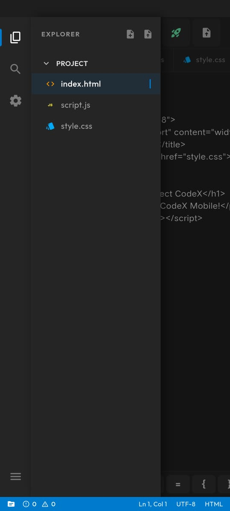
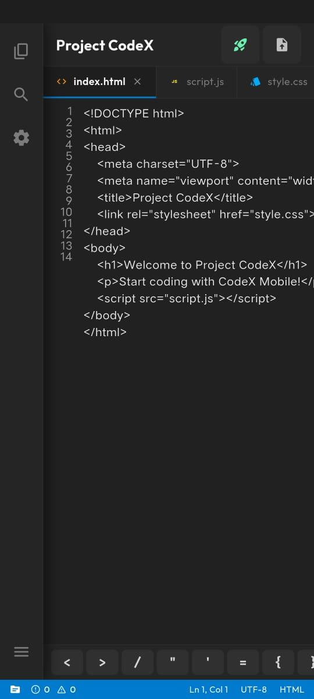

# CodeX - Professional Mobile IDE 🚀📱

[](https://play.google.com/store/apps/details?id=com.nexera.codex)
[](https://opensource.org/licenses/MIT)

CodeX is a high-performance, professional-grade IDE for Android and iOS that brings the power of desktop coding to your pocket. Designed for modern web developers, it offers a zero-compromise experience with lightning-fast syntax highlighting and instant live previews.

---

## 💎 Premium Features

- **⚡ Turbo Performance**: Instant file loading and zero-latency editing, even for heavy projects.
- **🎨 Smart Syntax**: Advanced highlighting for HTML, CSS, JavaScript, and more.
- **🌐 Live Preview**: Built-in web engine to see your changes in real-time.
- **🛡️ Zero Permissions**: Absolute privacy. Your code stays on your device—offline and secure.
- **📱 Native Symbols Toolbar**: Expertly crafted toolbar for fast coding on touch devices.

---

## 📸 Screenshots

| Dashboard | Editor | Preview |
| :---: | :---: | :---: |
|  |  |  |

---

## 🛠️ Tech Stack

- **Frontend**: Flutter / Dart
- **State Management**: Riverpod
- **Editor Engine**: Code Text Field
- **Web Interface**: Vite + React + Tailwind CSS

---

## 🚀 Getting Started

### Prerequisites
- [Flutter SDK](https://docs.flutter.dev/get-started/install) (3.10.x or higher)
- Android Studio / VS Code

### Installation
1. Clone the repository:
   ```bash
   git clone https://github.com/karthi-AI-Hub/codex.git
   ```
2. Install dependencies:
   ```bash
   flutter pub get
   ```
3. Run the application:
   ```bash
   flutter run
   ```

---

## 📄 Legal

CodeX is licensed under the [MIT License](LICENSE). Visit our **[Official Website](https://play.google.com/store/apps/details?id=com.nexera.codex)** for the Privacy Policy and Terms of Service.

---

Developed with ❤️ by the **CodeX Team** (karthi.nexgen.dev@gmail.com)
